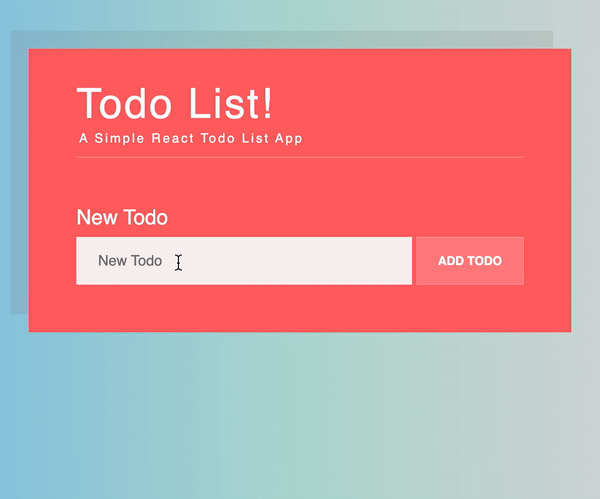

# Todo List Project

A Todo application created with Create React App where user can add new tasks to the todo list. Once task is added to list, it can be edited and saved or deleted. If user clicks on task, will strike through to show completion.

## Final Product

### Demo Video:

## Getting Started

1. Install dependencies using the `npm install` command.
2. Start the web server using the `npm start` command. The app will be served at <http://localhost:3000/>.
3. Go to <http://localhost:3000/> in your browser.

## Dependencies

- create react app
